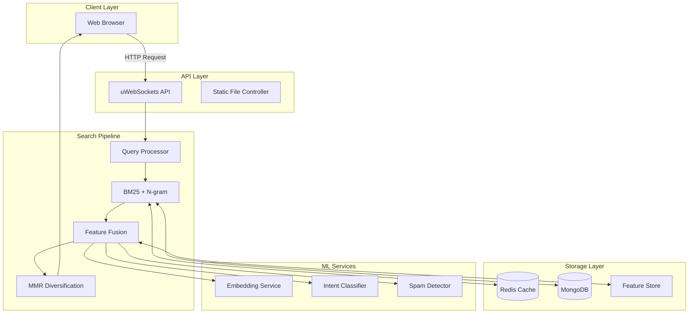

## Summary
Create comprehensive visual documentation of the system architecture, component interactions, and data flows for the universal multilingual search engine. This includes high-level overview diagrams, detailed component diagrams, and end-to-end dataflow visualization.

## Context
Clear architectural documentation is essential for:
- New team member onboarding
- System understanding and maintenance
- Capacity planning and scaling decisions
- Incident response and troubleshooting
- Architecture review and evolution

## Goals
- **Primary:** Create complete visual documentation of system architecture
- **Secondary:** Establish diagram maintenance workflow
- **Stretch:** Interactive diagram exploration tool

## Tasks

### Architecture Diagrams
- [ ] **System Overview Diagram**
  - High-level component architecture (Crawler → Indexer → Ranking → Serving)
  - External dependencies (MongoDB, Redis, Browserless)
  - Network boundaries and service interactions
  - Deployment topology (Docker containers, networking)

- [ ] **Component Interaction Diagram**
  - Controller → Storage → Service layer interactions
  - API endpoint routing and request flow
  - Authentication and middleware pipeline
  - WebSocket connections for real-time features

- [ ] **Data Pipeline Visualization**
  - Crawl → Parse → Normalize → Index → Store flow
  - Universal language processing pipeline (NFKC → Script detection → Language detection)
  - Batch job workflows (nightly updates, weekly refreshes)
  - Incremental vs. full index rebuild flows

### Dataflow Diagrams
- [ ] **Query Processing Flow**
  - Request ingestion (API endpoint)
  - Automatic language/script detection
  - Context-aware stopword filtering
  - Multi-stage retrieval (BM25 + n-gram fallback)
  - Feature gathering and scoring
  - Re-ranking and diversification (MMR)
  - Response formatting and caching

- [ ] **Indexing Dataflow**
  - Document ingestion from crawler
  - Text normalization and processing
  - Language detection and metadata extraction
  - Structured data extraction (Schema.org, ISBN, price)
  - Link graph building and HostRank computation
  - Index write and commit process
  - Deduplication and quality gates

- [ ] **Feature Store & Caching Layers**
  - Multi-layer cache architecture (L1: Memory, L2: Redis, L3: MongoDB)
  - Feature precomputation and storage
  - Cache invalidation strategies
  - TTL and versioning flow

### Universal Language Processing Flow
- [ ] **Multilingual Pipeline Diagram**
  - Unicode NFKC normalization for all scripts
  - Script-specific handling (Arabic ZWNJ, CJK segmentation, Cyrillic variants)
  - Automatic language detection (100+ languages)
  - Stopword detection via IDF analysis
  - Embedding generation and semantic similarity

- [ ] **Cross-Language Features**
  - Cross-lingual query expansion
  - Language-agnostic n-gram fallback
  - Universal quality and spam detection
  - Multi-script support visualization

### Machine Learning Pipelines
- [ ] **Training & Inference Flow**
  - Embedding model training (co-occurrence → PPMI/SVD → subword embeddings)
  - Click model training (DCTR/UBM/DBN)
  - Pairwise LTR training pipeline
  - Model versioning and deployment
  - Inference service architecture (batching, caching)

- [ ] **Online Learning Loop**
  - Click logging and impression tracking
  - Debiasing and label generation
  - Nightly model updates
  - A/B testing and interleaving framework
  - Model rollback procedures

### Deployment & Operations
- [ ] **Deployment Architecture**
  - Docker Compose service topology
  - Container networking and volumes
  - Environment variable configuration
  - Service dependencies and startup order

- [ ] **Monitoring & Observability**
  - Metrics collection flow (Prometheus/Grafana)
  - Log aggregation pipeline
  - Alert routing and escalation
  - Dashboard organization

## Technical Approach

### Diagramming Tools
```yaml
Primary Tools:
  - Mermaid: Version-controllable diagram-as-code
  - Draw.io/Excalidraw: Complex architectural diagrams
  - PlantUML: Sequence and component diagrams
  - Graphviz: Graph/network visualizations

Output Formats:
  - SVG: Scalable vector graphics (primary)
  - PNG: Raster images for quick previews
  - PDF: Print-ready documentation
  - HTML: Interactive diagrams
```

### Diagram-as-Code Example (Mermaid)


### Directory Structure
```
docs/
├── architecture/
│   ├── overview.md          # System overview with diagrams
│   ├── components.md        # Detailed component architecture
│   ├── dataflow.md          # Data pipeline documentation
│   ├── deployment.md        # Deployment architecture
│   └── diagrams/
│       ├── mermaid/         # Source .mmd files
│       ├── drawio/          # Source .drawio files
│       ├── svg/             # Exported SVG files
│       └── png/             # Exported PNG files
```

## Acceptance Criteria

### Completeness
- [ ] System overview diagram covers all major components
- [ ] Query processing flow documented end-to-end with all stages
- [ ] Indexing dataflow shows complete document lifecycle
- [ ] Universal language processing pipeline visualized for 5+ languages
- [ ] ML training and inference flows documented
- [ ] Deployment architecture matches actual Docker Compose setup
- [ ] All diagrams include legends and annotations

### Quality Standards
- [ ] Diagrams are clear and readable at 1080p resolution
- [ ] Consistent color coding and iconography across diagrams
- [ ] All external dependencies labeled (MongoDB, Redis, Browserless)
- [ ] Latency/performance annotations where relevant (e.g., "P95 < 300ms")
- [ ] Security boundaries clearly marked (network isolation, authentication)

### Maintainability
- [ ] All diagrams stored as source files (Mermaid/Draw.io)
- [ ] Automated export to SVG/PNG via CI/CD
- [ ] Version control for diagram sources in git
- [ ] Diagram update process documented
- [ ] Link-check validation for diagram references in docs

### Usability
- [ ] Diagrams embedded in README and main documentation
- [ ] Interactive HTML versions available (for Mermaid diagrams)
- [ ] Zoom-friendly SVG exports for complex diagrams
- [ ] Print-friendly PDF versions generated
- [ ] Diagrams referenced in troubleshooting guides

## Testing & Validation

### Diagram Review
```yaml
Review Checklist:
  - Accuracy: Does diagram match actual implementation?
  - Completeness: Are all components and flows represented?
  - Clarity: Can a new team member understand it?
  - Consistency: Does it align with other documentation?
  - Currency: Is it up-to-date with latest changes?
```

### Peer Review Process
- [ ] Technical review by 2+ team members
- [ ] Architecture review by senior engineer
- [ ] Usability test with new team member
- [ ] Incorporation of feedback and revisions
- [ ] Final approval and publication

## Documentation

### Diagram Catalog
Create `docs/architecture/README.md`:
```markdown
# Architecture Documentation

## Overview
- [System Overview](overview.md) - High-level architecture
- [Component Diagram](components.md) - Detailed component breakdown
- [Dataflow Diagram](dataflow.md) - End-to-end data pipeline

## Query Processing
- [Query Pipeline](query-pipeline.md) - Request to response flow
- [Ranking Formula](ranking-formula.md) - Feature fusion visualization

## Storage & Caching
- [Storage Architecture](storage.md) - MongoDB, Redis, Feature Store
- [Caching Layers](caching.md) - Multi-tier cache strategy

## Machine Learning
- [Training Pipelines](ml-training.md) - Model training workflows
- [Inference Services](ml-inference.md) - Serving architecture

## Deployment
- [Docker Architecture](deployment.md) - Container topology
- [Monitoring Setup](monitoring.md) - Observability stack
```

### Maintenance Schedule
```yaml
Update Frequency:
  - Major releases: Update all affected diagrams
  - Quarterly: Review all diagrams for accuracy
  - Annual: Complete documentation audit

Ownership:
  - Primary: Tech Lead / Architect
  - Backup: Senior Engineers
  - Review: All team members
```

## Notes

### Best Practices
1. **Start Simple:** Begin with high-level overview, drill down as needed
2. **Use Standards:** Follow C4 model (Context, Container, Component, Code)
3. **Annotate Clearly:** Add latency, throughput, and capacity annotations
4. **Show Reality:** Diagrams must match actual implementation
5. **Keep Current:** Update diagrams with code changes

### Common Pitfalls
- ❌ Over-complicated diagrams with too much detail
- ❌ Diagrams that don't match actual implementation
- ❌ Missing legends or unclear iconography
- ❌ Using only raster images (not scalable)
- ❌ No version control for diagram sources

### Tools & Resources
- [Mermaid Live Editor](https://mermaid.live/)
- [Draw.io Desktop](https://github.com/jgraph/drawio-desktop)
- [C4 Model](https://c4model.com/)
- [PlantUML](https://plantuml.com/)
- [Structurizr](https://structurizr.com/)

## Success Metrics
- New team members can understand system architecture within 1 day
- Diagrams referenced in 80%+ of technical discussions
- Architecture documentation viewed 50+ times/month
- Zero incidents caused by architectural misunderstanding
- Positive feedback from team in documentation survey

## Related Tasks
- 15.2 - API Specification (references architecture)
- 15.4 - Troubleshooting Runbooks (uses diagrams)
- 15.5 - Onboarding Documentation (relies on diagrams)
- 13.2 - Health Checks & Metrics (monitoring architecture)

---

**Celebration Criteria:** 🎉
- All core architecture diagrams created and reviewed
- Documentation published and accessible
- First new team member successfully onboarded using diagrams
- Positive feedback from team on diagram clarity and usefulness

