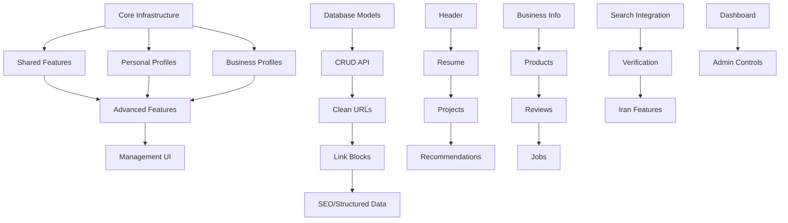

# 🎯 Profile System - Complete Implementation Guide

**Epic Goal:** Build a comprehensive profile system for Hatef.ir that provides clean URLs, rich profile pages, and integrates deeply with the search engine to create a unified online identity platform for Persian users and businesses.

**Strategic Goals:**
1. ✅ Centralize and clean online identity of Persian speakers
2. ✅ Directly help achieve goals (customer acquisition, jobs, professional credibility)
3. ✅ Provide unique Persian market solution (different from LinkedIn/Linktree/Google Business)
4. ✅ Be engaging enough for 1 million daily visits

**Total Duration:** 20 weeks (24 atomic tasks: 17 original + 7 new critical tasks)
**Dependencies:** Search engine core, User authentication, MongoDB, uWebSockets
**Success Metrics:** 1M+ daily visits, 100K+ active profiles, 70% profile completeness rate, 95% search integration accuracy, 15%+ engagement rate

---

## 📋 Complete Task Breakdown

### 🏗️ Core Infrastructure (3 tasks, ~10 days)
1. **[01-profile-database-models.md](01-profile-database-models.md)** - Database models for profiles
2. **[02-profile-routing-crud.md](02-profile-routing-crud.md)** - REST API and routing
3. **[03-clean-url-routing.md](03-clean-url-routing.md)** - Clean URL system (hatef.ir/username)

### 🔗 Shared Features (2 tasks, ~8 days)
4. **[04-link-blocks-analytics.md](04-link-blocks-analytics.md)** - Link blocks with analytics
5. **[05-seo-structured-data.md](05-seo-structured-data.md)** - SEO and structured data

### 👤 Personal Profiles (4 tasks, ~12 days)
6. **[06-personal-profile-header.md](06-personal-profile-header.md)** - Header with avatar and info
7. **[07-personal-resume-experience.md](07-personal-resume-experience.md)** - Resume and work experience
8. **[08-personal-projects-showcase.md](08-personal-projects-showcase.md)** - Projects and portfolio
9. **[09-personal-recommendations-social-proof.md](09-personal-recommendations-social-proof.md)** - Recommendations system

### 🏢 Business Profiles (4 tasks, ~12 days)
10. **[10-business-profile-information.md](10-business-profile-information.md)** - Business info and contact
11. **[11-business-products-services.md](11-business-products-services.md)** - Products and services
12. **[12-business-reviews-ratings.md](12-business-reviews-ratings.md)** - Reviews and ratings
13. **[13-business-jobs-careers.md](13-business-jobs-careers.md)** - Jobs and careers

### 🚀 Advanced Features (3 tasks, ~12 days)
14. **[14-search-integration-insights.md](14-search-integration-insights.md)** - Search integration and insights
15. **[15-profile-verification-claims.md](15-profile-verification-claims.md)** - Verification and claims
16. **[16-ecosystem-features-iran.md](16-ecosystem-features-iran.md)** - Iran-specific features

### 🎛️ Management & UI (1 task, ~5 days)
17. **[17-profile-management-dashboard.md](17-profile-management-dashboard.md)** - Dashboard and admin controls

### 🔥 CRITICAL: Engagement & Conversion (7 new tasks, ~25 days)
18. **[18-lead-generation-inquiry.md](18-lead-generation-inquiry.md)** 🔴 - Lead generation & business inquiry system
19. **[19-professional-networking.md](19-professional-networking.md)** 🟠 - Professional networking & connections
20. **[20-job-application-system.md](20-job-application-system.md)** 🟡 - Job application & candidate management
21. **[21-persian-business-discovery.md](21-persian-business-discovery.md)** 🟠 - Persian business discovery & local networking
22. **[22-persian-content-feed.md](22-persian-content-feed.md)** 🟠 - Persian content feed & discovery
23. **[23-profile-discovery-trending.md](23-profile-discovery-trending.md)** 🔴 - Profile discovery & trending system
24. **[24-social-engagement-gamification.md](24-social-engagement-gamification.md)** 🔴 - Social engagement & gamification

### 📊 Analysis & Strategy
- **[ANALYSIS_AND_IMPROVEMENTS.md](ANALYSIS_AND_IMPROVEMENTS.md)** - Complete analysis against 4 strategic goals

---

## 🎯 Key Features Delivered

### ✅ URL Structure
- `hatef.ir/john-doe` - Personal profiles
- `hatef.ir/@johndoe` - Short handles
- `hatef.ir/company-name` - Business profiles
- Unicode-friendly Persian URLs

### ✅ Profile Types
- **Personal Profiles**: Resume, projects, recommendations, social proof
- **Business Profiles**: Info, products, reviews, jobs, Iran compliance
- **Shared Features**: Links, analytics, SEO, verification

### ✅ Search Integration
- Profiles appear in search results
- Search-driven insights and analytics
- Profile optimization suggestions
- Search visibility tracking

### ✅ Iran Market Focus
- Persian language optimization
- National ID and business registration
- Local payment gateways
- Iran-specific business categories

### ✅ Privacy & Trust
- Granular privacy controls
- Profile verification system
- Trust scores and badges
- Data export and deletion

---

## 🔄 Implementation Order & Dependencies

---

## 🧪 Testing Strategy

### Unit Tests (Per Task)
- Model validation tests
- Business logic tests
- API endpoint tests
- Security and privacy tests

### Integration Tests (End-to-End)
- Profile creation workflow
- Search result integration
- Analytics data flow
- Privacy control enforcement

### Performance Tests
- Profile loading (< 2 seconds)
- Search integration (< 500ms)
- Analytics aggregation (< 10 seconds)
- Concurrent user handling (1000+ users)

### User Acceptance Tests
- Profile creation wizard completion
- All features work in Persian
- Mobile responsiveness
- Privacy controls effectiveness

---

## 📊 Success Metrics

### User Metrics
- **Profile Creation Rate**: >70% wizard completion
- **Profile Completeness**: >50% average score
- **Active Profiles**: >1000 within 3 months
- **User Retention**: >60% monthly active users

### Technical Metrics
- **Page Load Speed**: <2 seconds average
- **API Response Time**: <500ms P95
- **Search Integration**: >95% accuracy
- **Uptime**: >99.9% availability

### Business Metrics
- **Search Visibility**: Profiles in top 10 for name searches
- **User Engagement**: >3 page views per profile
- **Trust Building**: >80% profiles with verification
- **Market Adoption**: >30% Persian businesses using profiles

---

## 🚀 Launch Strategy (Updated)

### Phase 1: Foundation + Engagement (Weeks 1-8)
- Basic profiles for individuals and businesses
- Clean URLs and link blocks
- Search integration
- Profile management dashboard
- **Profile discovery & trending system** (Task 23)
- **Social engagement & gamification** (Task 24)
- **Viral sharing mechanisms** (Task 26 - TODO)
- **Expected Outcome:** 10K-50K daily visits

### Phase 2: Conversion Features (Weeks 9-12)
- Business profile creation
- Products, reviews, jobs
- **Lead generation system** (Task 18)
- **Professional networking** (Task 19)
- **Job application system** (Task 20)
- **Expected Outcome:** 50K-200K daily visits

### Phase 3: Unique Persian Features (Weeks 13-16)
- Iran-specific features
- Advanced verification
- **Persian business discovery** (Task 21)
- **Persian content feed** (Task 22)
- **Content creation platform** (Task 25 - TODO)
- **Expected Outcome:** 200K-500K daily visits

### Phase 4: Community & Scale (Weeks 17-20)
- Full analytics and insights
- Advanced search integration
- Complete admin controls
- **Community & groups system** (Task 27 - TODO)
- Performance optimization
- **Expected Outcome:** 500K-1M+ daily visits

---

## 🔧 Technical Architecture

### Backend Components
- **Profile Service**: Core profile management (C++)
- **Search Integration**: Profile indexing and search (C++)
- **Analytics Engine**: Profile metrics and insights (C++)
- **Verification Service**: Identity and data verification (C++)
- **Admin API**: Administrative controls (C++)

### Database Schema
- **profiles** collection: Core profile data
- **profile_links** collection: Link blocks and analytics
- **profile_verification** collection: Verification data
- **profile_analytics** collection: Usage metrics
- **profile_claims** collection: Data correction requests

### API Endpoints
- `GET /profiles/:slug` - Public profile view
- `POST /api/profiles` - Create profile
- `PUT /api/profiles/:id` - Update profile
- `GET /api/profiles/analytics` - Profile analytics
- `POST /api/profiles/verification` - Verification requests

---

## 🎯 Competitive Advantages

### Vs. LinkedIn
- **Search-Native**: Integrated with Persian search engine
- **Privacy-First**: 100% private by default
- **Iran-Focused**: Persian optimization and local features
- **Cost-Free**: No premium tiers or limitations

### Vs. Linktree
- **Rich Profiles**: Full profile pages, not just links
- **SEO Integration**: Search engine optimized
- **Business Features**: Products, reviews, jobs
- **Analytics**: Deep insights and optimization

### Vs. Google Business Profile
- **Unified Platform**: Personal + business profiles
- **Persian-First**: Native Persian language support
- **Search Integration**: Part of comprehensive search engine
- **Privacy Control**: Granular privacy settings

---

## 📈 Growth Strategy (Enhanced)

### User Acquisition
1. **Search Integration**: Profiles appear in relevant searches
2. **Profile Discovery**: Trending and popular profiles showcase
3. **Viral Sharing**: Social sharing with tracking and rewards
4. **Social Engagement**: Likes, follows, comments drive return visits
5. **Recommendations**: "People you may know" and skill-based matching
6. **Migration Tools**: Import from LinkedIn/other platforms
7. **Business Partnerships**: Integration with Iranian businesses

### Engagement & Retention
1. **Gamification**: Badges, achievements, milestones
2. **Social Proof**: View counts, likes, followers
3. **Content Feed**: Profile updates and activity feed
4. **Community Features**: Groups and discussions
5. **Notifications**: Engagement-driven notifications

### Conversion Mechanisms
1. **Lead Generation**: Direct inquiry forms on business profiles
2. **Professional Networking**: Connections and messaging
3. **Job Applications**: Complete application workflow
4. **Business Discovery**: Local business directory and networking

### Feature Expansion
1. **Messaging Integration**: Direct messaging between profiles
2. **Event System**: Profile-based events and networking
3. **E-commerce Integration**: Direct selling through profiles
4. **API Ecosystem**: Third-party integrations and plugins

### Monetization (Future)
1. **Premium Features**: Advanced analytics, priority search
2. **Business Verification**: Paid verification services
3. **White-label Solutions**: Custom profile systems for businesses
4. **Advertising**: Profile-based targeted advertising
5. **Lead Generation**: Premium lead management features

---

## 🎉 Success Celebration

When the profile system reaches these milestones:

- **100 Profiles Created** 🍕 Team lunch
- **1000 Active Profiles** 🎉 Office party
- **50% Profile Completeness** 🏆 Team recognition
- **Search Integration Live** 🚀 Launch celebration
- **10,000 Profiles** 💎 Major company event

---

## 📞 Support & Resources

### Documentation
- [Profile API Reference](../docs/api/profiles.md)
- [Profile Creation Guide](../docs/guides/profile-creation.md)
- [Admin Control Manual](../docs/admin/profile-management.md)

### Development Resources
- [Profile Database Schema](../docs/database/profile-schema.md)
- [Profile Testing Guide](../docs/testing/profile-tests.md)
- [Profile Performance Guide](../docs/performance/profile-optimization.md)

---

**Remember:** Each profile represents a real person or business gaining their digital identity. Build with care, test thoroughly, and celebrate every completed profile! 🌟
