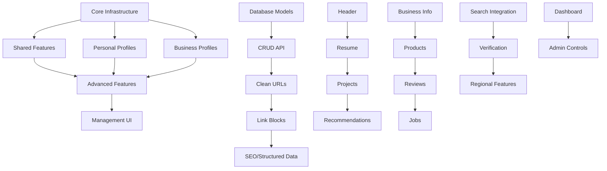

# 🎯 Profile System - Complete Implementation Guide

**Epic Goal:** Build a comprehensive profile system for Hatef.ir that provides clean URLs, rich profile pages, and integrates deeply with the search engine to create a unified online identity platform for users and businesses.

**Strategic Goals:**
1. ✅ Centralize and clean online identity of users
2. ✅ Directly help achieve goals (customer acquisition, jobs, professional credibility)
3. ✅ Provide unique local market solution (different from LinkedIn/Linktree/competitor business platforms)
4. ✅ Be engaging enough for 1 million daily visits

**Total Duration:** 26 weeks (40+ atomic tasks organized in phases)
**Dependencies:** Search engine core, User authentication, MongoDB, uWebSockets
**Success Metrics:** 1M+ daily visits, 100K+ active profiles, 70% profile completeness rate, 95% search integration accuracy, 15%+ engagement rate, K-factor >1.2 (viral growth), **common platform mistakes avoided: 8/8** ✅

---

## 📋 New Organization Structure

The profile system has been reorganized into **4 phases** with **8 feature groups** for better planning and execution:

### 🗂️ Organization
```
.github/ISSUE_TEMPLATE/profile-tasks/
├── phases/           # 4 development phases (MVP → Scale)
├── groups/           # 8 feature categories
└── tasks/            # 40+ individual task files
```

### 🚀 Development Phases
- **[Phase 0: MVP](phases/phase-0-mvp/)** (1-2 days) - Basic working system
- **[Phase 1: Foundation](phases/phase-1-foundation/)** (Weeks 1-4) - Complete infrastructure
- **[Phase 2: Conversion](phases/phase-2-conversion/)** (Weeks 5-8) - Business outcomes
- **[Phase 3: Advanced](phases/phase-3-advanced/)** (Weeks 9-16) - Unique features
- **[Phase 4: Scale](phases/phase-4-scale/)** (Weeks 17-24) - Enterprise features

### 🎯 Feature Groups
- **[Infrastructure](groups/infrastructure/)** - Core platform systems
- **[Personal Profiles](groups/personal-profiles/)** - Individual professional features
- **[Business Profiles](groups/business-profiles/)** - Company profile features
- **[Shared Features](groups/shared-features/)** - Cross-profile functionality
- **[Advanced Features](groups/advanced-features/)** - Innovative capabilities
- **[Engagement](groups/engagement/)** - Social interaction features
- **[Viral Growth](groups/viral-growth/)** - Sharing and referral systems
- **[Management](groups/management/)** - Admin and moderation tools

## 🛡️ Best Practices Applied

This profile system learns from common platform failures. Every task addresses specific mistakes:

1. ✅ **Clear "Why"** - Every feature has obvious value (users never understood purpose in failed platforms)
2. ✅ **Real Metrics** - Track jobs/customers, not vanity metrics (failed platforms had millions of users but low engagement)
3. ✅ **Simple UX** - Ultra-simple onboarding <2min (failed platforms had confusing interfaces)
4. ✅ **No Force** - Profile optional, never required (forced adoption causes backlash)
5. ✅ **Privacy First** - Transparent security, 24h breach notification (failed platforms hid breaches for months)
6. ✅ **Creator Value** - Clear ROI for businesses/professionals (failed platforms had unclear value proposition)
7. ✅ **Clear Identity** - Professional platform, NOT social network (failed platforms confused users with shifting identity)
8. ✅ **User Problems** - Solve local market needs, don't copy competitors (failed platforms just copied competitors)

---

## 📋 Task Breakdown by Phase

### 🚀 Phase 0: MVP (1-2 days)
**Goal:** Get basic profile system working end-to-end
- **[01a-database-mvp.md](tasks/01a-database-mvp.md)** - Basic profile models (no encryption)
- **[02-profile-routing-crud.md](tasks/02-profile-routing-crud.md)** - Basic CRUD operations
- **[03-clean-url-routing.md](tasks/03-clean-url-routing.md)** - Clean URL routing

### 🏗️ Phase 1: Foundation (Weeks 1-4, ~20 days)
**Goal:** Complete infrastructure and basic features
- **[01b-database-personal-business.md](tasks/01b-database-personal-business.md)** - Person/Business models
- **[01c-privacy-architecture.md](tasks/01c-privacy-architecture.md)** - Privacy & encryption
- **[01d-database-indexes-validation.md](tasks/01d-database-indexes-validation.md)** - Indexes & validation
- **[04-link-blocks-analytics.md](tasks/04-link-blocks-analytics.md)** - Link analytics
- **[05-seo-structured-data.md](tasks/05-seo-structured-data.md)** - SEO optimization
- **[14a-search-indexing.md](tasks/14a-search-indexing.md)** - Search indexing
- **[14b-search-results-integration.md](tasks/14b-search-results-integration.md)** - Search results
- **[15a-verification-basic.md](tasks/15a-verification-basic.md)** - Basic verification
- **[17-profile-management-dashboard.md](tasks/17-profile-management-dashboard.md)** - Management dashboard
- **Personal Profile Features:** 06-09 (headers, resume, projects, recommendations)
- **Business Profile Features:** 10-13 (info, products, reviews, jobs)

### 🎯 Phase 2: Conversion (Weeks 5-8, ~20 days)
**Goal:** Enable direct goal achievement (leads, jobs, networking)
- **[15b-verification-advanced.md](tasks/15b-verification-advanced.md)** - Advanced verification & claims
- **[18a-lead-forms.md](tasks/18a-lead-forms.md)** - Contact forms for businesses
- **[18b-lead-management.md](tasks/18b-lead-management.md)** - Lead tracking & analytics
- **[19a-connections-basic.md](tasks/19a-connections-basic.md)** - Professional connections
- **[19b-professional-messaging.md](tasks/19b-professional-messaging.md)** - Professional messaging
- **[20a-job-application-workflow.md](tasks/20a-job-application-workflow.md)** - Job applications
- **[20b-candidate-management.md](tasks/20b-candidate-management.md)** - Candidate management
- **[23-profile-discovery-trending.md](tasks/23-profile-discovery-trending.md)** - Profile discovery
- **[24a-profile-views-tracking.md](tasks/24a-profile-views-tracking.md)** - View analytics

### 🚀 Phase 3: Advanced (Weeks 9-16, ~40 days)
**Goal:** Unique features and advanced engagement
- **[16-regional-market-features.md](tasks/16-regional-market-features.md)** - Local market features
- **[21-local-business-discovery.md](tasks/21-local-business-discovery.md)** - Local business discovery
- **[22a-content-creation.md](tasks/22a-content-creation.md)** - Content creation tools
- **[22b-content-discovery.md](tasks/22b-content-discovery.md)** - Content feed & discovery
- **[24b-likes-follows.md](tasks/24b-likes-follows.md)** - Social engagement
- **[24c-comments-discussions.md](tasks/24c-comments-discussions.md)** - Comments & discussions
- **[24d-gamification-achievements.md](tasks/24d-gamification-achievements.md)** - Gamification
- **[26a-sharing-basic.md](tasks/26a-sharing-basic.md)** - Sharing features
- **[26b-viral-mechanics.md](tasks/26b-viral-mechanics.md)** - Viral mechanics
- **[26c-referral-rewards.md](tasks/26c-referral-rewards.md)** - Referral program
- **[27a-groups-basic.md](tasks/27a-groups-basic.md)** - Basic group features
- **[27b-group-features.md](tasks/27b-group-features.md)** - Advanced group features

### ⚖️ Phase 4: Scale (Weeks 17-24, ~30 days)
**Goal:** Community, scale, and enterprise features
- **[27c-group-moderation.md](tasks/27c-group-moderation.md)** - Group moderation & governance
- **[28-value-proposition-onboarding.md](tasks/28-value-proposition-onboarding.md)** - Onboarding & education

---

## 📋 Legacy Task Breakdown (28 Tasks Total)

### 🏗️ Core Infrastructure (3 tasks, ~10 days)
1. **[01-profile-database-models.md](01-profile-database-models.md)** - Database models + **Privacy-first architecture** ✨
2. **[02-profile-routing-crud.md](02-profile-routing-crud.md)** - REST API and routing
3. **[03-clean-url-routing.md](03-clean-url-routing.md)** - Clean URL system (hatef.ir/username)

### 🔗 Shared Features (2 tasks, ~8 days)
4. **[04-link-blocks-analytics.md](04-link-blocks-analytics.md)** - Link blocks with analytics
5. **[05-seo-structured-data.md](05-seo-structured-data.md)** - SEO and structured data

### 👤 Personal Profiles (4 tasks, ~12 days)
6. **[06-personal-profile-header.md](06-personal-profile-header.md)** - Header with avatar and info
7. **[07-personal-resume-experience.md](07-personal-resume-experience.md)** - Resume and work experience
8. **[08-personal-projects-showcase.md](08-personal-projects-showcase.md)** - Projects and portfolio
9. **[09-personal-recommendations-social-proof.md](09-personal-recommendations-social-proof.md)** - Recommendations system

### 🏢 Business Profiles (4 tasks, ~12 days)
10. **[10-business-profile-information.md](10-business-profile-information.md)** - Business info and contact
11. **[11-business-products-services.md](11-business-products-services.md)** - Products and services
12. **[12-business-reviews-ratings.md](12-business-reviews-ratings.md)** - Reviews and ratings
13. **[13-business-jobs-careers.md](13-business-jobs-careers.md)** - Jobs and careers

### 🚀 Advanced Features (3 tasks, ~12 days)
14. **[14-search-integration-insights.md](14-search-integration-insights.md)** - Search integration + **Profile as benefit (not requirement)** ✨
15. **[15-profile-verification-claims.md](15-profile-verification-claims.md)** - Verification + **Transparent security & incident response** ✨
16. **[16-regional-market-features.md](16-regional-market-features.md)** - Regional market features

### 🎛️ Management & UI (1 task, ~5 days)
17. **[17-profile-management-dashboard.md](17-profile-management-dashboard.md)** - Dashboard + **Real success metrics (not vanity)** ✨

### 🔥 CRITICAL: Engagement & Conversion (7 tasks, ~25 days)
18. **[18-lead-generation-inquiry.md](18-lead-generation-inquiry.md)** 🔴 - Lead generation & business inquiry system
19. **[19-professional-networking.md](19-professional-networking.md)** 🟠 - Professional networking & connections
20. **[20-job-application-system.md](20-job-application-system.md)** 🟡 - Job application & candidate management
21. **[21-local-business-discovery.md](21-local-business-discovery.md)** 🟠 - Local business discovery & networking
22. **[22-content-feed-discovery.md](22-content-feed-discovery.md)** 🟠 - Content feed + **NOT a social network** ✨
23. **[23-profile-discovery-trending.md](23-profile-discovery-trending.md)** 🔴 - Profile discovery & trending system
24. **[24-social-engagement-gamification.md](24-social-engagement-gamification.md)** 🔴 - Social engagement & gamification

### 🚀 CRITICAL: Viral Growth & Community (2 tasks, ~9 days)
26. **[26-viral-sharing-referral.md](26-viral-sharing-referral.md)** 🔴 - Viral sharing + **NOT social media** ✨
27. **[27-community-groups.md](27-community-groups.md)** 🟡 - Communities + **Professional focus** ✨

### 🎯 NEW CRITICAL: Value Proposition & Anti-Patterns (1 task, ~3 days)
28. **[28-value-proposition-onboarding.md](28-value-proposition-onboarding.md)** 🔴 - **Clear value, simple onboarding, anti-patterns avoided** ✨ NEW!

### 📊 Analysis & Strategy
- **[ANALYSIS_AND_IMPROVEMENTS.md](ANALYSIS_AND_IMPROVEMENTS.md)** - Complete analysis against 4 strategic goals (✅ ALL GOALS ACHIEVED)
- **Best Practices Applied** - 8 critical lessons implemented across all tasks ✅

---

## 🎯 Key Features Delivered

### ✅ URL Structure
- `hatef.ir/john-doe` - Personal profiles
- `hatef.ir/@johndoe` - Short handles
- `hatef.ir/company-name` - Business profiles
- Unicode-friendly Persian URLs

### ✅ Profile Types
- **Personal Profiles**: Resume, projects, recommendations, social proof
- **Business Profiles**: Info, products, reviews, jobs, regional compliance
- **Shared Features**: Links, analytics, SEO, verification

### ✅ Search Integration
- Profiles appear in search results
- Search-driven insights and analytics
- Profile optimization suggestions
- Search visibility tracking

### ✅ Regional Market Focus
- Persian language optimization
- National ID and business registration
- Local payment gateways
- Regional market-specific business categories

### ✅ Privacy & Trust
- Granular privacy controls
- Profile verification system
- Trust scores and badges
- Data export and deletion

---

## 🔄 Implementation Order & Dependencies



---

## 🧪 Testing Strategy

### Unit Tests (Per Task)
- Model validation tests
- Business logic tests
- API endpoint tests
- Security and privacy tests

### Integration Tests (End-to-End)
- Profile creation workflow
- Search result integration
- Analytics data flow
- Privacy control enforcement

### Performance Tests
- Profile loading (< 2 seconds)
- Search integration (< 500ms)
- Analytics aggregation (< 10 seconds)
- Concurrent user handling (1000+ users)

### User Acceptance Tests
- Profile creation wizard completion
- All features work in local language
- Mobile responsiveness
- Privacy controls effectiveness

---

## 📊 Success Metrics

### User Metrics
- **Profile Creation Rate**: >70% wizard completion
- **Profile Completeness**: >50% average score
- **Active Profiles**: >1000 within 3 months
- **User Retention**: >60% monthly active users

### Technical Metrics
- **Page Load Speed**: <2 seconds average
- **API Response Time**: <500ms P95
- **Search Integration**: >95% accuracy
- **Uptime**: >99.9% availability

### Business Metrics
- **Search Visibility**: Profiles in top 10 for name searches
- **User Engagement**: >3 page views per profile
- **Trust Building**: >80% profiles with verification
- **Market Adoption**: >30% local businesses using profiles

---

## 🚀 Launch Strategy (Updated)

### Phase 1: Foundation + Engagement (Weeks 1-8)
- Basic profiles for individuals and businesses
- Clean URLs and link blocks
- Search integration
- Profile management dashboard
- **Profile discovery & trending system** (Task 23)
- **Social engagement & gamification** (Task 24)
- **Viral sharing & referral system** (Task 26) ✅
- **Expected Outcome:** 10K-50K daily visits

### Phase 2: Conversion Features (Weeks 9-12)
- Business profile creation
- Products, reviews, jobs
- **Lead generation system** (Task 18)
- **Professional networking** (Task 19)
- **Job application system** (Task 20)
- **Expected Outcome:** 50K-200K daily visits

### Phase 3: Unique Local Market Features (Weeks 13-16)
- Regional market-specific features
- Advanced verification
- **Local business discovery** (Task 21)
- **Content feed with advanced creation tools** (Task 22) ✅
- **Expected Outcome:** 200K-500K daily visits

### Phase 4: Community & Scale (Weeks 17-24)
- Full analytics and insights
- Advanced search integration
- Complete admin controls
- **Community & groups system** (Task 27) ✅
- Performance optimization
- Marketing and growth campaigns
- **Expected Outcome:** 500K-1M+ daily visits

---

## 🔧 Technical Architecture

### Backend Components
- **Profile Service**: Core profile management (C++)
- **Search Integration**: Profile indexing and search (C++)
- **Analytics Engine**: Profile metrics and insights (C++)
- **Verification Service**: Identity and data verification (C++)
- **Admin API**: Administrative controls (C++)

### Database Schema
- **profiles** collection: Core profile data
- **profile_links** collection: Link blocks and analytics
- **profile_verification** collection: Verification data
- **profile_analytics** collection: Usage metrics
- **profile_claims** collection: Data correction requests

### API Endpoints
- `GET /profiles/:slug` - Public profile view
- `POST /api/profiles` - Create profile
- `PUT /api/profiles/:id` - Update profile
- `GET /api/profiles/analytics` - Profile analytics
- `POST /api/profiles/verification` - Verification requests

---

## 🎯 Competitive Advantages

### Vs. LinkedIn
- **Search-Native**: Integrated with local search engine
- **Privacy-First**: 100% private by default
- **Regional Market-Focused**: Local language optimization and regional features
- **Cost-Free**: No premium tiers or limitations

### Vs. Linktree
- **Rich Profiles**: Full profile pages, not just links
- **SEO Integration**: Search engine optimized
- **Business Features**: Products, reviews, jobs
- **Analytics**: Deep insights and optimization

### Vs. Competitor Business Platforms
- **Unified Platform**: Personal + business profiles
- **Local Language-First**: Native local language support
- **Search Integration**: Part of comprehensive search engine
- **Privacy Control**: Granular privacy settings

---

## 📈 Growth Strategy (Enhanced)

### User Acquisition
1. **Search Integration**: Profiles appear in relevant searches
2. **Profile Discovery**: Trending and popular profiles showcase
3. **Viral Sharing & Referral**: QR codes, referral rewards, viral tracking (Task 26) ✅
4. **Social Engagement**: Likes, follows, comments drive return visits (Task 24) ✅
5. **Recommendations**: "People you may know" and skill-based matching (Task 23) ✅
6. **Community & Groups**: Industry and location-based communities (Task 27) ✅
7. **Migration Tools**: Import from LinkedIn/other platforms
8. **Business Partnerships**: Integration with local businesses

### Engagement & Retention
1. **Gamification**: Badges, achievements, milestones (Task 24) ✅
2. **Social Proof**: View counts, likes, followers (Task 24) ✅
3. **Content Feed**: Profile updates and activity feed (Task 22) ✅
4. **Community Features**: Groups and discussions (Task 27) ✅
5. **Notifications**: Engagement-driven notifications
6. **Viral Rewards**: Referral rewards and recognition (Task 26) ✅

### Conversion Mechanisms
1. **Lead Generation**: Direct inquiry forms on business profiles (Task 18) ✅
2. **Professional Networking**: Connections and messaging (Task 19) ✅
3. **Job Applications**: Complete application workflow (Task 20) ✅
4. **Business Discovery**: Local business directory and networking (Task 21) ✅

### Feature Expansion
1. **Messaging Integration**: Direct messaging between profiles
2. **Event System**: Profile-based events and networking
3. **E-commerce Integration**: Direct selling through profiles
4. **API Ecosystem**: Third-party integrations and plugins

### Monetization (Future)
1. **Premium Features**: Advanced analytics, priority search, extended content creation tools
2. **Business Verification**: Paid verification services
3. **White-label Solutions**: Custom profile systems for businesses
4. **Advertising**: Profile-based targeted advertising
5. **Lead Generation**: Premium lead management features
6. **Referral Bonuses**: Premium referral rewards and benefits
7. **Community Premium**: Premium group features and tools

---

## 🎉 Success Celebration

When the profile system reaches these milestones:

- **100 Profiles Created** 🍕 Team lunch
- **1000 Active Profiles** 🎉 Office party
- **50% Profile Completeness** 🏆 Team recognition
- **Search Integration Live** 🚀 Launch celebration
- **10,000 Profiles** 💎 Major company event

---

## 📞 Support & Resources

### Documentation
- [Profile API Reference](../docs/api/profiles.md)
- [Profile Creation Guide](../docs/guides/profile-creation.md)
- [Admin Control Manual](../docs/admin/profile-management.md)

### Development Resources
- [Profile Database Schema](../docs/database/profile-schema.md)
- [Profile Testing Guide](../docs/testing/profile-tests.md)
- [Profile Performance Guide](../docs/performance/profile-optimization.md)

---

**Remember:** Each profile represents a real person or business gaining their digital identity. Build with care, test thoroughly, and celebrate every completed profile! 🌟
